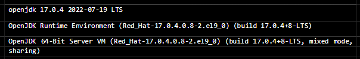
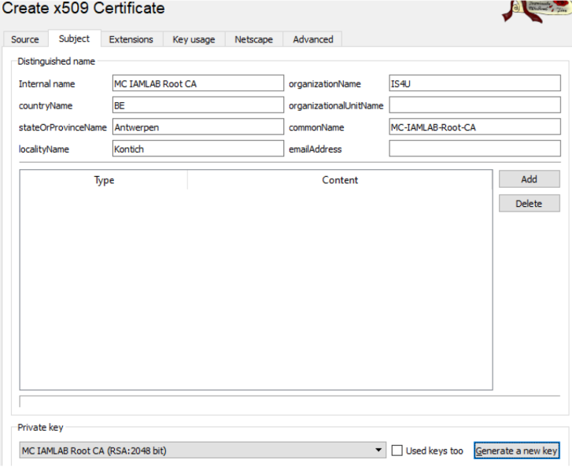

## How to set up keycloak

first go to the [keycloak](https://www.keycloak.org/downloads) site to donwload the required packages. Once you finished the download you transfer the file to the environment you want to run it on. 

## basic installation of keycloak 
Keycloak uses Java VM, so we need to install a java package preferably Java 11. By running the next command you'll get a list with the available packages. 
```shell
dnf search java
 ```
 install the packages 
 ```shell 
 dnf -y install java-17-openjdk-headles
 ```
```shell
  dnf clean all 
```
```shell
  dnf java version
```
After installment this should be the result.


<!-- !!!!!!!!!!!!!!!!KAN EVENTUEEL MEER FOTO'S GERBUIKEN VAN MASTERCLASS OEF. -->

## Database PostgreSQL
PostgreSQL is een vrije relationele databaseserver, uitgegeven onder de PostgreSQL licence, gelijkwaardig aan de flexibele BSD-licentie. Het biedt een alternatief voor zowel opensource-databasemanagementsystemen, zoals MariaDB en Firebird, als voor propriëtaire systemen, zoals Oracle, Oracle MySQL, DB2 en Microsoft SQL Server. PostgreSQL wordt niet beheerd of gecontroleerd door één enkel bedrijf, maar steunt op een wereldwijde gemeenschap van ontwikkelaars en bedrijven. De lijst van medewerkers, van voltijds-ontwikkelaars tot ad-hoc-testers, is al jarenlang ongeveer 300-400 namen lang. 

You can also follow the tutorial of [postgreSQL](https://www.postgresql.org/download/linux/redhat/) itself o install from repositories provided by PostgreSQL team  itself, but we’ll ignore that for now.

!> since we need a database so we can succesfully launch keycloak, first we will configure PostgreSQL, we'll start with the listening address:  

```shell
dnf install postgresql-server postgresql
```
```shell
dnf clean all 
```
begofore configuringthe database. We're are going to launch the PostgreSQL database using the following command: 
```shell
/usr/bin/postgresql-setup --initdb 
```
Which should give the following output. Which confirms that the database is ready to be configured.

```bash 
* Initializing database in '/var/lib/pgsql/data' 
* Initialized, logs are in /var/lib/pgsql/initdb_postgresql.log
```

```shell
sed "s/^#listen_addresses = 'localhost'/listen_addresses = 'localhost,192.168.254.66'/g" 
-i /var/lib/pgsql/data/postgresql.conf; 
``` 

Now that we configured the listen address , we also need to allow remote connections on that servcice, execute the following command for this: 

```shell 
 cat << EOF | sudo tee /var/lib/pgsql/data/pg_hba.conf 
# TYPE  DATABASE        USER            ADDRESS                 METHOD 
 
# "local" is for Unix domain socket connections only 
local   all             all                                     peer 
# IPv4 local connections: 
host    all             all             127.0.0.1/32            md5 
# IPv6 local connections: 
host    all             all             ::1/128                 md5 
 
# Remote Connections 
host    all             all             192.168.254.0/24           md5 
 
# Allow replication connections from localhost, by a user with the 
# replication privilege. 
local   replication     all                                     peer 
host    replication     all             127.0.0.1/32            ident 
host    replication     all             ::1/128                 ident 
EOF
``` 

Ensure that your network range is included in the `Remote Connections` settings. Remember this configuration 
file as you may need to reconfigure it depending on your network setup (routing vs NATing
Finally, we will start PostgreSQL and ensure it will automatically start when we boot our system.We can verify whether PostgreSQL is listening on the *:5432 port using the `show sockets` command: 

```shell
systemctl enable postgresql --now
```
```shell
ss -tlpn; 
```
```shell
systemctl status postgresql; 
```
Which should give the following output: 


now that the postgrSQL is configured we can now acces the shell with: 

```shell
sudo -u postgres psql;
```
When running previous command this should output the following:

```
could not change directory to "/root": Permission denied 
psql (13.7) 
Type "help" for help. 
 
postgres=#
```
next, we'll check out the exisiting schema's 
!> a schema is a namespace that contains named database objects such as tables, views, indexes, data types, functions, stored procedures and operators

```shell
SELECT schema_name FROM information_schema.schemata;
```
Which again should give the following output:

```
    schema_name 
-------------------- 
 pg_toast 
 pg_catalog 
 public 
 information_schema 
(4 rows)
```

If you do not want table layout, we can use expanded layout in `psql` with: 
```shell 
\x 
SELECT schema_name FROM information_schema.schemata; 
```

```
-[ RECORD 1 ]------------------- 
schema_name | pg_toast 
-[ RECORD 2 ]------------------- 
schema_name | pg_catalog 
-[ RECORD 3 ]------------------- 
schema_name | public 
-[ RECORD 4 ]------------------- 
schema_name | information_schema 
```

### firewall 
now it is not necessary, we can configure the firewall so that you can access it remotely 

Although it is not necessary, we can configure the firewall as well: 
firewall-cmd --permanent --add-port=5432/tcp; 
firewall-cmd --reload; 
success 
You will now be able to access it remotely. 
  


<!-- ------------------------------------------------------------------------------- -->

## Deploy keycloak 
Since we already installed Java JDK, we just need to deploy keycloak you can get the latset version form the keycloak website as prevously mentioned. But since we installed Java we kan also download it with the following command. 

```shell
mkdir -p /opt/keycloak
curl https://github.com/keycloak/keycloak/releases/download/19.0.1/keycloak-19.0.1.tar.gz -L | tar --strip-components=1 -zxf - -C /opt/keycloak;
 ```

Create an extra user just in case if you dont want to run keycloak as the root user of your linux system. en dont forget the permissions in an bash commmand it will look like this:

```shell
useradd --shell /bin/sh --uid 1001 keycloak; 
```
```shell
chown keycloak: /opt/keycloak -R; 
```
```shell
 ll /opt/keycloak/ 
```

before we runkeycloak we still have to expose it to the network we're currently using to fix this issue we'll expose the common used ports.
```bash
firewall-cmd --add-port=8080/tcp --permanent; 
firewall-cmd --add-port=8443/tcp --permanent; 
firewall-cmd --add-port=80/tcp --permanent; 
firewall-cmd --add-port=443/tcp --permanent; 
firewall-cmd --reload;
```

start keycloak with the following command, you can always stop it with ```CTR + C ``` : 
```shell
sudo -u keycloak bin/kc.sh start-dev;
```


After installing and starting keycloak you should be able to navigate to the machine's IP address wich is on the defautl port 8080 in this case it is http://192.168.254.66:8080


## Certificates

## generate self signed certificate to enbale https

you can do it with the following command: 
```bash
 keytool -genkeypair -storepass password -storepass passworde -storetype PKCS12 -keyalg RSA -keysize 2048 -dname "CN=server" -alias server -ext "SAN:c=DNS:localhost,IP:127.0. 
 ```

Or you can use: [XCA](https://hohnstaedt.de/xca) ( wich we'll use in this case)
This application is intended for creating and managing X.509 certificates, certificate requests, RSA, DSA and EC private keys, Smartcards and CRLs.
Everything that is needed for a CA is implemented.
All CAs can sign sub-CAs recursively. These certificate chains are shown clearly.
For an easy company-wide use there are customiseable templates that can be used for certificate or request generation.

### Root CA
Another important part of a network-facing service is the engineer’s capability to understand and configure 
certificates. In this case we will set up a `server certificate` which is used to authenticate our Keycloak network 
service and encrypt all traffic in transit. 
The  authentication portion is  based on  the already-established trust in your system’s keystore (or Mozilla 
Firefox’ keystores in case you’re using that browser). Where the certificate of the server is signed by a party 
(Certificate Authority) that our system, or we, trust. Based on this delegated trust, we can verify the authenticity 
of the service presenting itself. 
The encryption part happens after the client, our browser, has verified the server’s identity and establishes 
session keys to encrypt further communication. For an in-depth explanation how this protocol works, refer to 
an online article, e.g.: Cloudflare. 
For now, we will generate a certificate authority using XCA. Download and install the program. 

- Open the software and create a new certificate
- In the tab `Source` leave everything default and ensure that  `default CA` is selected as the template, click 
on `Apply  all`, this will set up some default CA configuration for the CA Certificate.

- In the subject tab you can enter your preferd values 
- Click on `Generate a new key`, leave the settings default to RSA 2048 and click on `Create`, you should have something like this:




- The `Key usage` tab should only have the following options selected: 
  - X509v3 Key Usage 
  - Certificate Sign 
  - CRL Sign

- The `Netscape` tab may require modification, it should have the following `Cert Types` selected: 

  - SSL CA 
  - S/MIME CA 
  - Object Signing CA

- The `Advanced` tab should look like: 


!> However, and this is important to remember, since we are creating a root signing certificate which we will later also will import in our trust store and therefore will have ultimate trust 

We want to limit the server and/or client certificates this CA can sign, more specifically, we will limit it s signing 
capabilities to: 
  - Our IAMLAB domains, in my case  `*.keycloak.amdev`
The reason is simple: in case this CA gets hijacked and given the comparatively loose security restrictions of 
a laptop versus a HSM, it will be able to sign any certificate  and therefore compromise everything. We can 
easily avoid this by  scoping the CA  heavily to  our own domains. Although the attack  is  not common, and 
probably highly advanced in nature, it occurred several times.

To apply this configuration, click on the `Edit` button in the  `Advanced` tab and enter the following value:

```
nameConstraints = permitted;DNS:iamlab.local,permitted;DNS:.iamlab.local 
```

Great, click on `OK` to finalize the certificate. 
The Root CA is now generated and can be used to sign other certificates, which we will cover next

### server certificate 
Now we will generate a server certificate, signed by our Root CA. 
- In XCA, select the Root CA, and click on `New Certificate`

In the wizard, it should show that `MC IAMLAB  Root CA` will be used to sign this certificate, this is desired. If this is not the case, make sure that it does, otherwise restart the process. If you are unable to continue with 
using the Root CA as signer, do not continue and let someone know. 
On the first page, we will also select `[default] HTTPS_server` as our template, and click on `Apply all`, this 
should select the correct x509v3 EKU and other relevant settings for performing `Server Authentication`.

- In the subject tab you can enter your preferd values 
- Click on `Generate a new key`, leave the settings default to RSA 2048 and click on `Create` 

Now we’ll add a  required extension as well, namely the `X509v3 Subject  Alternative  Name(s)` or more 
commonly called the `SANs`, click on `Edit`, and add the following entries:

!> be sure to change the DN value if you enterd a different domain. 

<table>
  <tr>
    <th>DN Key</th>
    <th>DN Value</th>
  </tr>
  <tr>
    <td>DNS</td>
    <td>keycloak.amdev</td>
  </tr>
</table>

- Then click on `apply`
- The `Key usage` tab should only have the following options selected: 

- X509v3 Key Usage 
  - Digital Signature 
  - Non Repudiation 
  - Key Encipherment 
-  X509v3 Extended Key Usage 
  - TLS Web Server Authentication  (make sure to select this)

- The `Netscape` tab may require modification, it should have the following `Cert Types` selected: 
  - SSL Server 
- You may adjust the `Netscape comment` to something like `iam2201.iamlab.local`. 
The `Advanced` tab should look like: 

And finaly click on `OK` to finelize the certificate: 

## Export and Import cert

-  For the export we will perform the following: 
  - Export the Root CA Certificate 
  - Export the Server Certificate and private key as PKCS#12 format 

- Exporting the  Root  CA  Certificate is  simple , select it  in XCA and click on `Export`, this should open the XCA wizard

- Ensure to select the correct path and the export format should be set to `PEM (*.crt)`, click on `OK` to perform the export. 
- Same process for the Server Certificate, except the export format should be set to `PKCS#12 (*.p12)`
- Click  on  `OK`  to  perform the  export,  this  will  prompt  for  a  password,  I  will choose  something  simple: `wachtwoord`. 

Great, the necessary components are now exported, and we are ready to import them

### The import will take place on the following components: 
-  Root CA: 
  - Imported into your laptop’s CA trust chain 
  - Imported in the virtual machine’s CA trust chain 
  - Optionally: imported into Mozilla Firefox’ CA trust chain 
- Server Certificate: 
  - Will be used by Keycloak 

First, open  WinSCP  (or  Filezilla)  and  open  a  connection  to  your  virtual  machine  and  copy  over  the 
`MC_IAMLAB_Root_CA.crt` and `iam2201.iamlab.local.p12` files:

Now to ensure that our virutual environment trust this new CA, exectut the following commands, this should install the new Root CA in the system truststore.
A Truststore is used to store certificates from Certified Authorities (CA) that verify the certificate presented by the server in SSL connection.

```shell 
cp /root/MC_IAMLAB_Root_CA.crt /etc/pki/ca-trust/source/anchors/; 
update-ca-trust extract;
```
```shell
cat /etc/pki/ca-trust/extracted/pem/tls-ca-bundle.pem | grep -i iamlab
```
when running this command it should provide the following output. It also depends on what name you have given it. 

```
# MC-IAMLAB-Root-CA 
```

## Certificate installation on PC 
Back on your workstation, install the Root CA, by double-clicking it, this should open the Microsoft Certificate Information wizard. 
Click on `Install Certificate`. Depending on your system privileges, you can install in `Current User`, or `Local Machine`, the latter being selected when you have administrator privileges. Manually select `Place all  certificates in the following  store` and select the`Trusted Root Certification 
Authorities` store, click `Next` and finally `Finish`. It will generate a message,warning you that you are about to ultimately trust a new Root CA
- click on `Yes` to finalize the process. 

## Certificate installation on firefox


- When you are using Mozilla Firefox, you should also install in its separate trust store, click on `Settings > Privacy & Security` and search for the `View certificates` button
- Click on the tab `Authorities` and import the same Root CA:
- Since our only purpose is Web Server Authentication, we simply select `Trust this CA to identify web sites`, 
- click `OK` to finalize the import.

### Certificate installation on keycloak 
Now that  we installed the  Root  CA  in  the  necessary trust  stores,  we can  finally make Keycloak use the 
PKCS#12 keystore, which has 2 components: 
• Private key 
• Certificate 
Navigate to your Keycloak installation directory an copy the PKCS#12 file We’ll also rename the file, since we’re working with private keys, the permissions should be modified as 
such.

```shell
cd /opt/keycloak/conf/
```
```shell 
cp /root/iam2201.iamlab.local.p12 /opt/keycloak/conf/server.p12 
```
```shell
chown root:keycloak server.p12; 
chmod 0640 server.p12;
```

And finally, we will modify the “/opt/keycloak/conf/keycloak.conf” file, namely add the following entries. Again, use the previously used password and name you gave it. 

```bash 
https-key-store-file=${kc.home.dir}conf/server.p12 
https-key-store-password=wachtwoord
```

Now you should be able to start Keycloak again. Remember, that you enabled the certificate with the domainname, so connecting on the IP should no longer work. To fix this error we need to add the host in our local host file. 

!> A hosts file is a local file that contains domain names and their matching IP addresses.

Open command prompt as `administrator` on your workstation, and enter the following commands:

```shell  
notepad drivers\etc\hosts 
```

This should open `notepad.exe` with the `hosts` file, and enter the following value.

```
192.168.254.66 iam2201.iamlab.local 
```
!> these are the values for this guides example be sure to check your ip adress. 

Save the file, and attempt to connection on the `Fully Qualified Domain Name` FQDN now and you should see the keycloak admin console and no certifiate warnings!.

